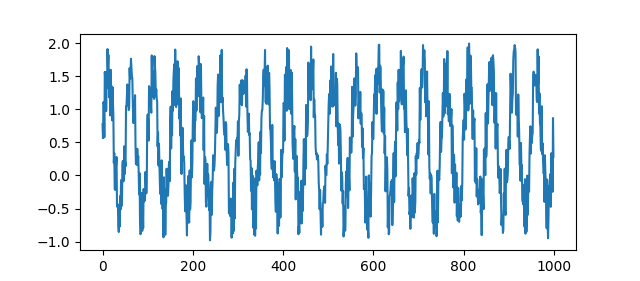

<div align="center">
<h1 align="center">Periodicity Detection</h1>
<p>
Detect the dominant period in univariate, equidistant time series data.
</p>

[](https://github.com/CodeLionX/periodicity-detection/actions/workflows/build.yml)
[](https://periodicity-detection.readthedocs.io/en/latest/?badge=latest)
[](https://codecov.io/gh/CodeLionX/periodicity-detection)
[](https://badge.fury.io/py/periodicity-detection)
[](https://opensource.org/licenses/MIT)

[](https://pepy.tech/project/periodicity-detection)

</div>

---

Toolbox for detecting the dominant period in univariate, equidistant time series data.
The toolbox contains the following methods:

- Autocorrelation
- AutoPeriod
- Fast Fourier Transform (FFT)
- `find_length`
- Python-adaption of the R package `forecast`'s `findfrequency` function
- Number of Peaks-method

📖 Periodicity Detection's documentation is hosted at https://periodicity-detection.readthedocs.io.

Recommended reading: [Window Size Selection In Unsupervised Time Series Analytics: A Review and Benchmark](https://project.inria.fr/aaltd22/files/2022/08/AALTD22_paper_3876.pdf):
Workshop paper that compares the _Autocorrelation_, _FFT_ (_DFT_ in the paper), and _AutoPeriod_ methods to three other methods ([Code](https://github.com/ermshaua/window-size-selection)).

# Installation

You can install Periodicity Detection as a package or from source.

## Prerequisites

- python >= 3.7, <= 3.11
- pip >= 20

## Installation using `pip` (recommended)

```shell
pip install periodicity-detection
```

## Installation from source

```shell
git clone git@github.com:CodeLionX/periodicity-detection.git
cd periodicity-detection
pip install .
```

## Usage

Periodicity Detection can be used as a Python library or as a command line tool.
Please refer to the [package documentation](https://periodicity-detection.readthedocs.io) for more information.

### API

```python
import numpy as np
import periodicity_detection as pyd

# Create sample data
data = np.sin(np.linspace(0, 40 * np.pi, 1000)) + np.random.default_rng(42).random(1000)

# Calculate period size using a specific method
period_size = pyd.findfrequency(data, detrend=True)
assert period_size == 50

# Calculate period size using the default method
period_size = pyd.estimate_periodicity(data)
assert period_size == 50
```

Plot of the example dataset:



### CLI

```shell
$> periodicity --help
usage: periodicity [-h] [--version] [--use-initial-n USE_INITIAL_N]
                   [--channel CHANNEL]
                   dataset_path
                   {find-length,number-peaks,autocorrelation,fft,autoperiod,findfrequency}
                   ...

Detect the dominant period in univariate, equidistant time series data.

positional arguments:
  dataset_path          Path to the dataset for which the dominant period size
                        should be estimated.
  {find-length,number-peaks,autocorrelation,fft,autoperiod,findfrequency}
    find-length         Determine period size based on ACF as in the TSB-UAD
                        repository.
    number-peaks        Calculates the number of peaks of at least support n
                        in the time series and the time series length divided
                        by the number of peaks defines the period size.
    autocorrelation     Determine period size based on ACF.
    fft                 Determine period size based on FFT.
    autoperiod          AUTOPERIOD method calculates the period size in a two-
                        step process. First, it extracts candidate periods
                        from the periodogram. Then, it uses the circular
                        autocorrelation to validate the candidate periods.
    findfrequency       Determine period size using the method findfrequency
                        from the R forecast package. Re-implementation!

optional arguments:
  -h, --help            show this help message and exit
  --version             Show version number.
  --use-initial-n USE_INITIAL_N
                        Only use the n initial points of the dataset to
                        calculate the estimated period size.
  --channel CHANNEL     If the dataset is multivariate, use the channel on
                        this integer position. The first dimension is always
                        assumed to be the index and skipped over!

```
